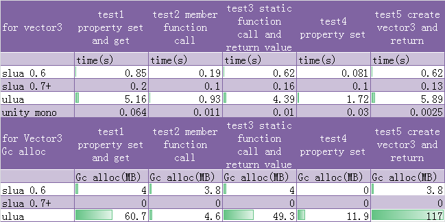

#slua
Fastest Unity lua binding via static code generating.

Website: http://www.slua.net

Mail List: [Subscribe](http://www.freelists.org/list/slua) (in English only)

QQ group: 15647305 (in Chinese)

Support QA: http://www.unityqa.com/ (in Chinese)

Mail to : sineysan#163.com (both of Chinese/English)

##Release Download

[here.](https://github.com/pangweiwei/slua/releases/latest)

##Integrate with 3rd Lua Library

Standard slua release doesn't contains any 3rd Lua library(like protobuf, lpeg etc), if you want to use this library, can visit this forked repo https://github.com/luzexi/slua, it focus slua on integrate with other 3rd library.

##Demo with slua

This repo https://github.com/lulersoft/ME_SLua based on slua for simple game framework.

This repo https://github.com/yaukeywang/2DPlatformer-SLua demonstrate 2DPlatformer game using slua.

This repo https://github.com/tenvick/hugula demonstrate Tetris game using slua.

##Help

See inner demo for help or [Document](../../wiki/中文帮助) (in chinese).

##Important

For running demo sucessful, you should generate lua wrap file by your self:

Click menu, SLua->All->Make  generate all wrap file for your version of unity.

***Had tested for Unity4.6.1/4.6.2/4.6.3/5.0/5.1***

##Main feature

static code generating, no reflection, no extra gc alloc, very fast

remote debugger

full support iOS/iOS64, support il2cpp

above 90% UnityEngine interface exported ( remove flash, platform dependented interface )

100% UnityEngine.UI interface ( require Unity4.6+ )

support UnityEvent/UnityAction for event callback via lua function

support delegate via lua function (include iOS)

support yield call

support custom class exported

support extension method

export enum as integer

return array as lua table

using raw luajit, can be replaced with lua5.3/lua5.1

##Usage

copy Assets/Plugins Assets/Slua to your $Project$/Assets folder, you will see Slua menu, 

click Unity->Make UnityEngine, regenerate UnityEngine interface for lua

click Unity->Make UI, regenerate UnityEngine.UI interface for lua

click Custom->Make, generate custom class interface for lua

Clear custom, delete all generated custom interface

Slua/LuaObject contain pre-generated file for exported interface.

Precompiled slua library in Plugins only included x86(32bit)/macosx(32bit)/iOS(armv7,armv7s,arm64)/Android(armv7-a) platform using luajit, you should compile other platform/lua5.1/luajit by yourself, see build.txt for help.

##Usage at a glance

~~~~~~~~~~lua

-- import
import "UnityEngine"

function main()

	-- create gameobject
	local cube = GameObject.CreatePrimitive(UnityEngine.PrimitiveType.Cube)

	-- find gameobject
	local go = GameObject.Find("Canvas/Button")
	
	-- get component by type name
	local btn = go:GetComponent("Button")
	
	-- get out parameter
	local ok,hitinfo = Physics.Raycast(Vector3(0,0,0),Vector3(0,0,1),Slua.out)
	print("Physics Hitinfo",ok,hitinfo)
	
	-- foreach enumeratable object
	for t in Slua.iter(Canvas.transform) do
		print("foreach transorm",t)
	end
	
	-- add event listener
	btn.onClick:AddListener(function()
		local go = GameObject.Find("Canvas/Text")
		local label = go:GetComponent("Text")
		label.text="hello world"
	end)
	
	-- use vector3
	local pos = Vector3(10,10,10)+Vector3(1,1,1)
	cube.transform.position = pos
	
	-- use coroutine
	local c=coroutine.create(function()
		print "coroutine start"

		Yield(WaitForSeconds(2))
		print "coroutine WaitForSeconds 2"

		local www = WWW("http://www.sineysoft.com")
		Yield(www)
		print(#Slua.ToString(www.bytes))
	end)
	coroutine.resume(c)

	-- add delegate
	Deleg.daction = {"+=",self.actionD} --it's ok for iOS
	
	-- remove delegate
	Deleg.daction = {"-=",self.actionD} --it's ok for iOS
	
	-- set delegate
	Deleg.daction = function() print("callback") end --it's ok for iOS
	
	-- remove all
	Deleg.daction = nil
end

~~~~~~~~~~

##Export custom class

add CustomLuaClass attribute to your custom class, waiting for compile completed, click "SLua->Custom->Make", you will get interface file for lua.

~~~~~~~~~~c#

[CustomLuaClass]
public class HelloWorld   {

}

~~~~~~~~~~

##How to remote debug

Wiki here(https://github.com/pangweiwei/slua/wiki/Remote-Debug).

###Benchmark

see http://www.sineysoft.com/post/164 for detail (in chinese), compared with ulua/raw mono.

**with luajit**

unit is secend, run 200k times / test, more smarller more better.

